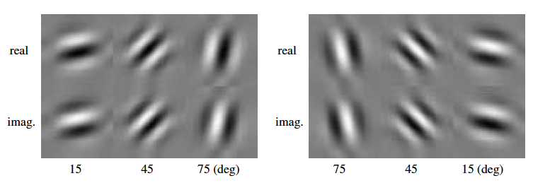

DTCWT in Pytorch Wavelets
=========================

Pytorch wavelets is a port of `dtcwt_slim`__, which was my first attempt at
doing the DTCWT quickly on a GPU. It has since been cleaned up to run for
pytorch and do the quickest forward and inverse transforms I can make, as well
as being able to pass gradients through the inputs.

For those unfamiliar with the DTCWT, it is a shift invariant wavelet transform
that comes with limited redundancy. Compared to the undecimated wavelet
transform, which has :math:`2^J` redundancy, the DTCWT only has :math:`2^d`
redundancy (where d is the number of input dimensions - i.e. 4:1 redundancy for
image transforms). Instead of producing 3 output subbands like the DWT, it
produces 6, which roughly represent 15, 45, 75, 105, 135 and 165 degree
wavelets. On top of this, the 6 subbands have real and imaginary outputs which
are in quadrature with each other (similar to windowed sine and cosine
functions, or the gabor wavelet).

It is possible to calculate similar transforms (such as the morlet or gabor)
using fourier transforms, but the DTCWT is faster as it uses separable
convolutions.

__ https://github.com/fbcotter/dtcwt_slim

Notes
-----
Because of the above mentioned properties of the DTCWT, the output is slightly
different to the DWT. As mentioned, it is 4:1 redundant in 2D, so we expect
4 times as many coefficients as from the decimated wavelet transform. These
extra coefficients come from:

- 6 subband outputs instead of 3 with ial and imaginary coefficients instead 
  of just real. For an :math:`N \times N` image, the first level bandpass has
  :math:`3N^2` instead of :math:`3N^2/4` coefficients.
- The lowpass is always at double the resolution of what you'd expect it to be
  for the level in the wavelet tree. I.e. for a 1 level transform, the lowapss
  output is still :math:`N\times N`. For a two level transform, it is :math:`N/2
  \times N/2` and so on.  

Example
-------

.. code:: python

    import torch
    from pytorch_wavelets import DTCWTForward, DTCWTInverse
    xfm = DTCWTForward(J=3, biort='near_sym_b', qshift='qshift_b')
    X = torch.randn(10,5,64,64)
    Yl, Yh = xfm(X) 
    print(Yl.shape)
    >>> torch.Size([10, 5, 16, 16])
    print(Yh[0].shape) 
    >>> torch.Size([10, 5, 6, 32, 32, 2])
    print(Yh[1].shape)
    >>> torch.Size([10, 5, 6, 16, 16, 2])
    print(Yh[2].shape)
    >>> torch.Size([10, 5, 6, 8, 8, 2])
    ifm = DTCWTInverse(biort='near_sym_b', qshift='qshift_b')
    Y = ifm((Yl, Yh))

Like with the DWT, Yh returned is a tuple. There are 2 extra dimensions - the
first comes between the channel dimension of the input and the row dimension.
This is the 6 orientations of the DTCWT. The second is the final dimension, which is the
real an imaginary parts (complex numbers are not native to pytorch). I.e. to
access the real part of the 45 degree wavelet for the first subband, you would
use :code:`Yh[0][:,:,1,:,:,0]`, and the imaginary part of the 165 degree wavelet
would be :code:`Yh[0][:,:,5,:,:,1]`. 

The above images were created by doing a forward transform with an input of
zeros (creates a pyramid with the correct size bands), and then setting the
centre spatial value to 1 for each of the orientations at the third scale. I.e.:

.. code:: python

    import numpy as np
    import torch
    from pytorch_wavelets import DTCWTForward, DTCWTInverse
    xfm = DTCWTForward(J=3)
    ifm = DTCWTInverse()
    x = torch.zeros(1,1,64,64)
    # Create 12 outputs, one for the real and imaginary point spread functions
    # for each of the 6 orientations
    out = np.zeros((12,64,64)
    yl, yh = xfm(x)
    for b in range(6):
      for ri in range(2):
        yh[2][0,0,b,4,4,ri] = 1
        out[b*2 + ri] = ifm((yl, yh))
        yh[2][0,0,b,4,4,ri] = 0
    # Can now plot the output

Advanced Options
----------------
There is a whole host of advanced options for calculating the DTCWT. The above
example shows the use case that will work most of the time. However, here are
some more ways the DTCWT can be done:

Custom Biorthogonal and Qshift Filters
~~~~~~~~~~~~~~~~~~~~~~~~~~~~~~~~~~~~~~
Rather than specifying the type of filter for the layer 1 (biort), and layer 2+
(qshift) transforms, you can provide the filters directly. They should be given
as a tuple of array-like objects. For the biorthogonal filters, this is
a 2-tuple of low and highpass filters. For the qshift filters, this will be
a 4-tuple of low for tree a, low for tree b, high for tree a and high for tree
b filters.

E.g.:

.. code:: python
  
  from pytorch_wavelets import DTCWTForward
  from pytorch_wavelets.dtcwt.coeffs import biort
  # The standard style
  xfm1 = DTCWTForward(biort='near_sym_a', J=1)
  # Get our own filters, here we reverse the standard filters so they 
  # still have the right properties, only changing the phase
  h0o, _, h1o, _ = biort('near_sym_a')
  xfm2 = DTCWTForward(biort=(h0o[::-1], h1o[::-1]), J=1)

Note that you must be careful when doing this, as the filters are designed to
have the correct phase properties, so any changes will likely result in a loss
of the quarter shift and hence the shift invariant properties of the transform.

Skipping Highpasses
~~~~~~~~~~~~~~~~~~~
There is the option to not calculate the bandpass outputs at given scales. This
can speed up the transform if you know that there is very little useful content
in some areas of the frequency space. To do this, you can give a list of
booleans to the `skip_hps` parameter (if it is a single boolean, that is then
used for all the scales). The first value corresponds to the first
scale highpass outputs, and a value of true means do not calculate them.

E.g.:

.. code:: python

  from pytorch_wavelets import DTCWTForward
  xfm = DTCWTForward(J=3, skip_hps=[True, False, False])
  yl, yh = xfm(torch.randn(1, 1, 64, 64))
  print(yh[0].shape)
  >>> torch.Size([0])
  print(yh[1].shape)
  >>> torch.Size([1, 1, 6, 16, 16, 2])

Naturally, the inverse transform happily accepts tensors with 0 shape (or even
`None`'s) and sets that level to be all zeros.

Changing the output shape
~~~~~~~~~~~~~~~~~~~~~~~~~
By default the highpass outputs have an extra 2 dimensions, one at the end for
complex values, and one after the channel dimension, for the 6 orientations.
E.g. an input of shape of :math:`(N, C_{in}, H_{in}, W_{in})` will have bandpass 
coefficients with shapes :math:`list(N, C_{in}, 6, H_{in}'', W_{in}'', 2)`,
(we've put dashes next to the height and width as they will change with scale). 

You can choose where the orientations and real and imaginary dimensions go with
the options `o_dim` and `ri_dim`, which are by default 2 and -1.

Including all the lowpasses
~~~~~~~~~~~~~~~~~~~~~~~~~~~
In case you want to get all the intermediate lowpasses, you can with the
`include_scale` parameter. This works a bit like the `skip_hps` where you can
provide a single boolean to apply it to all the scales, or a list of booleans to
fine tune which lowpasses you want.

If any of the value in `include_scale` is true, then the transform output will
change, and the lowpass will be a tuple.

E.g.

.. code:: python

  from pytorch_wavelets import DTCWTForward
  xfm1 = DTCWTForward(J=3)
  xfm2 = DTCWTForward(J=3, include_scale=True)
  xfm3 = DTCWTForward(J=3, include_scale=[False, True, True])
  x = torch.randn(1, 1, 64, 64)
  yl, yh = xfm1(x)
  print(yl.shape)
  >>> torch.Size([1, 1, 16, 16])
  # Now do xfm2 which will give back all scales
  yl, yh = xfm2(x)
  for l in yl:
    print(yl.shape)
  >>> torch.Size([1, 1, 64, 64]) 
  >>> torch.Size([1, 1, 32, 32]) 
  >>> torch.Size([1, 1, 16, 16]) 
  # Now do xfm3 which will give back the last two scales
  yl, yh = xfm3(x)
  for l in yl:
    print(yl.shape)
  >>> torch.Size([0]) 
  >>> torch.Size([1, 1, 32, 32]) 
  >>> torch.Size([1, 1, 16, 16]) 

Note that to do the inverse transform, you have to give the final lowpass
output. You can provide None to indicate it's all zeros, but you cannot provide
all the intermediate lowpasses.

