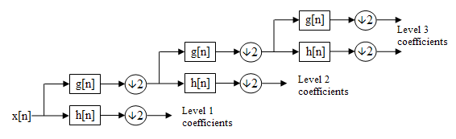
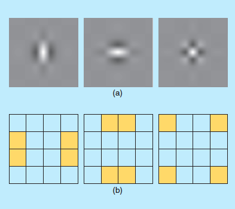
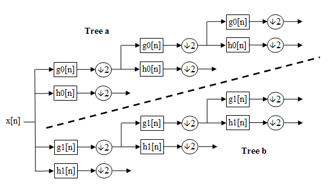
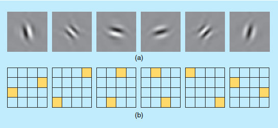
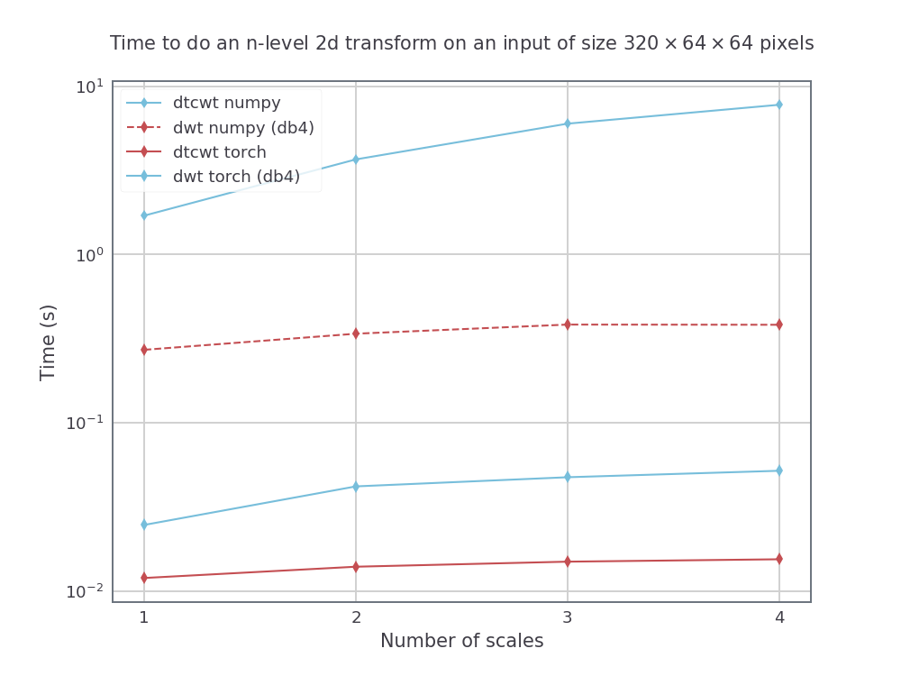

Introduction
============

|Build Status|

.. |Build Status| image:: https://travis-ci.org/fbcotter/pytorch_wavelets.png?branch=master
    :target: https://travis-ci.org/fbcotter/pytorch_wavelets

This package provides support for computing the 2D discrete wavelet and 
the 2d dual-tree complex wavelet transforms, their inverses, and passing 
gradients through both using pytorch.

The implementation is designed to be used with batches of multichannel images.
We use the standard pytorch implementation of having 'NCHW' data format.

This repo originally was only for the use of the DTCWT, but I have added some DWT support. This is still in development,
and has the following known issues:

- Uses reflection padding instead of symmetric padding for the DWT
- Doesn't compute the DWT separably, instead uses the full `N x N` kernel.


   
   The subband implementation of the discrete wavelet transform



   The equivalent point spread functions of the dwt (a) and the areas of the
   frequency plane each filter selects (b). Image taken from
   :cite:`selesnick_dual-tree_2005`.



   The subband implementation of the dual tree complex wavelet transform



   The equivalent point spread functions of the dtcwt (a) and the areas of the
   frequency plane each filter selects (b). Image taken from
   :cite:`selesnick_dual-tree_2005`.

Installation
````````````
The easiest way to install ``pytorch_wavelets`` is to clone the repo and pip install
it. Later versions will be released on PyPi but the docs need to updated first::

    $ git clone https://github.com/fbcotter/pytorch_wavelets
    $ cd pytorch_wavelets
    $ pip install .

(Although the `develop` command may be more useful if you intend to perform any
significant modification to the library.) A test suite is provided so that you
may verify the code works on your system::

    $ pip install -r tests/requirements.txt
    $ pytest tests/

Notes
`````
See the other docs

Floating Point Type
~~~~~~~~~~~~~~~~~~~
By default, the filters will use 32-bit precision, as is the common case with
gpu operations. You can change to 64-bit by calling
:code:`torch.set_default_dtype(torch.float64)` before the transforms are
constructed.

Running on the GPU
~~~~~~~~~~~~~~~~~~
This should come as no surprise to pytorch users. The DWT and DTCWT transforms support
cuda calling:

.. code:: python

    import torch
    from pytorch_wavelets import DTCWTForward, DTCWTInverse
    xfm = DTCWTForward(J=3, biort='near_sym_b', qshift='qshift_b').cuda()
    X = torch.randn(10,5,64,64).cuda()
    Yl, Yh = xfm(X) 
    ifm = DTCWTInverse(J=3, biort='near_sym_b', qshift='qshift_b').cuda()
    Y = ifm((Yl, Yh))

The automated tests cannot test the gpu functionality, but do check cpu running.
To test whether the repo is working on your gpu, you can download the repo,
ensure you have pytorch with cuda enabled (the tests will check to see if
:code:`torch.cuda.is_available()` returns true), and run:

.. code:: 

    pip install -r tests/requirements.txt
    pytest tests/

From the base of the repo.

Backpropagation
~~~~~~~~~~~~~~~
It is possible to pass gradients through the forward and backward transforms.
All you need to do is ensure that the input to each has the required_grad
attribute set to true.

Speed Tests
~~~~~~~~~~~
We compare doing the dtcwt with the python package and doing the dwt with
PyWavelets to doing both in pytorch_wavelets, using a GTX1080. The numpy methods
were run on a 14 core Xeon Phi machine using intel's parallel python. For the
dtwcwt we use the `near_sym_a` filters for the first scale and the `qshift_a`
filters for subsequent scales. For the dwt we use the `db4` filters.

For a fixed input size, but varying the number of scales (from 1 to 4) we have
the following speeds (averaged over 5 runs):



For an input size with height and width 512 by 512, we also vary the batch size
for a 3 scale transform. The resulting speeds were:

.. image:: batchsize.png


Provenance
``````````
Based on the Dual-Tree Complex Wavelet Transform Pack for MATLAB by Nick
Kingsbury, Cambridge University. The original README can be found in
ORIGINAL_README.txt.  This file outlines the conditions of use of the original
MATLAB toolbox.

.. bibliography:: references.bib

.. vim:sw=4:sts=4:et
